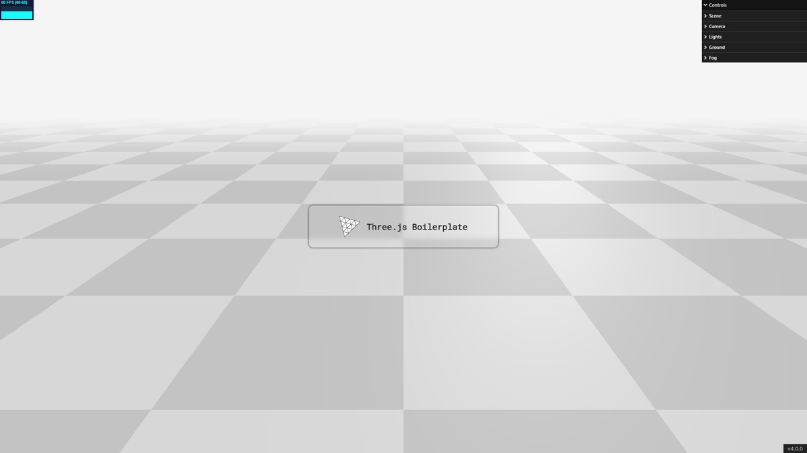

# Three Havok #

> [Havok](https://www.havok.com/) physics engine with [three.js](https://threejs.org/)

<!--  -->

## Download ##

`git clone https://github.com/UstymUkhman/three-havok.git`

`cd three-havok`

## Develop ##

`pnpm i`

`pnpm start`

## Lint ##

`pnpm lint:js`

`pnpm lint:css`

## Test ##

`pnpm test`

`pnpm test:watch`

`pnpm test:cover`

## Build ##

`pnpm build`

`pnpm serve`
